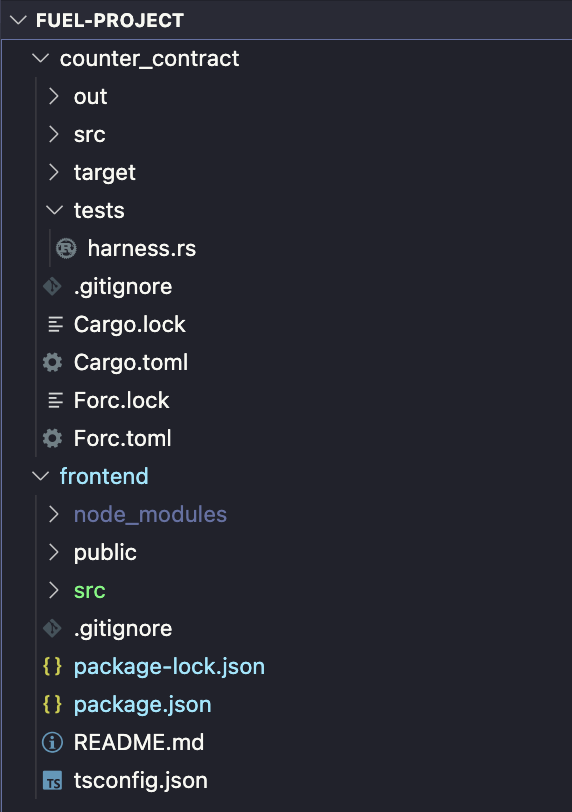

# Developer Quickstart

This guide will walk developers through writing a smart contract in Sway, a simple test, deploying to Fuel, and building a frontend.

Before we begin, it may be helpful to understand terminology that will used throughout the docs and how they relate to each other:

- **Fuel**: the Fuel blockchain.
- **FuelVM**: the virtual machine powering Fuel.
- **Sway**: the domain-specific language crafted for the FuelVM; it is inspired by Rust.
- **Forc**: the build system and package manager for Sway, similar to Cargo for Rust.

## Understand Sway Program Types

There are four types of Sway programs:

- `contract`
- `predicate`
- `script`
- `library`

Contracts, predicates, and scripts can produce artifacts usable on the blockchain, while a library is simply a project designed for code reuse and is not directly deployable.

The main features of a smart contract that differentiate it from scripts or predicates are that it is callable and stateful.

A script is runnable bytecode on the chain which can call contracts to perform some task. It does not represent ownership of any resources and it cannot be called by a contract.

|             | deployable on the blockchain:       | can have state:      | callable on the blockchain: | designed for code reuse: |
|-------------|-------------------------------------|----------------------|-----------------------------|--------------------------|
| contract  | ✅                                  | ✅                   | ✅                          | ❌                        |
| predicate | ✅                                  | ❌                    | ❌                           | ❌                        |
| script    | ❌                                   | ❌                    | ❌                           | ❌                        |
| library   | ✅ (via a contract or predicate) | ❌ | ❌                           | ✅                       |

See [the chapter on program types](../sway-program-types/index.md) for more information.

## Your First Sway Project

We'll build a simple counter contract with two functions: one to increment the counter, and one to return the value of the counter.

A few pieces of info that will be helpful before moving on:

- This guide was created using VSCode as the code editor.
- Download the Sway language extension in VSCode to get syntax highlighting, keyboard shortcuts, and more.
- Download the rust-analyzer extension in VSCode to get syntax highlighting, code completion, and more.

**Start by creating a new, empty folder. We'll call it `fuel-project`.**

### Writing the Contract

First, let's [install the Sway toolchain](https://github.com/FuelLabs/fuelup).

Then with `forc` installed, create a contract project inside of your `fuel-project` folder:

```sh
$ cd fuel-project
$ forc new counter_contract
To compile, use `forc build`, and to run tests use `forc test`

----

Read the Docs:
- Sway Book: https://fuellabs.github.io/sway/latest
- Rust SDK Book: https://fuellabs.github.io/fuels-rs/latest
- TypeScript SDK: https://github.com/FuelLabs/fuels-ts

Join the Community:
- Follow us @SwayLang: https://twitter.com/SwayLang
- Ask questions in dev-chat on Discord: https://discord.com/invite/xfpK4Pe

Report Bugs:
- Sway Issues: https://github.com/FuelLabs/sway/issues/new
```

Here is the project that `Forc` has initialized:

```console
├── fuel-project
    ├── Cargo.toml
    ├── Forc.toml
    ├── src
    │   └── main.sw
    └── tests
        └── harness.rs
```

`Forc.toml` is the _manifest file_ (similar to `Cargo.toml` for Cargo or `package.json` for Node) and defines project metadata such as the project name and dependencies. You'll notice a `Cargo.toml` file because `forc` uses `cargo` under the hood.

Open your project in a code editor and delete the boilerplate code in `src/main.sw` so that you start with an empty file.

Every Sway file must start with a declaration of what type of program the file contains; here, we've declared that this file is a contract.

```sway
contract;
```

Next, we'll define a storage value. In our case, we have a single counter that we'll call `counter` of type 64-bit unsigned integer and initialize it to 0.

```sway
storage {
    counter: u64 = 0,
}
```

### ABI

An ABI defines an interface, and there is no function body in the ABI. A contract must either define or import an ABI declaration and implement it. It is considered best practice to define your ABI in a separate library and import it into your contract because this allows callers of the contract to import and use the ABI in scripts to call your contract.

For simplicity, we will define the ABI directly in the contract file.

```sway
abi Counter {
    #[storage(read, write)]
    fn increment();

    #[storage(read)]
    fn count() -> u64; 
}
```

### Going line by line

`#[storage(read, write)]` is an annotation which denotes that this function has permission to read and write values in storage.

`fn increment();` - We're introducing the functionality to increment and denoting it shouldn't return any value.

`#[storage(read)]` is an annotation which denotes that this function has permission to read values in storage.

`fn counter() -> u64;` - We're introducing the functionality to increment the counter and denoting the function's return value.

### Implement ABI

Below your ABI definition, you will write the implementation of the functions defined in your ABI.

```sway
impl Counter for Contract {
    #[storage(read)]
    fn count() -> u64 {
      storage.counter
    }
    #[storage(read, write)]
    fn increment(){
        storage.counter = storage.counter + 1;
    }
}
```

> **Note**
> `return storage.counter;` is equivalent to `storage.counter`.

### What we just did

Read and return the counter property value from the contract storage.

```sway
fn count() -> u64 {
    return storage.counter;
}
```

The function body accesses the value counter in storage, and increments the value by one. Then, we return the newly updated value of counter.

```sway
fn increment() {
    storage.counter = storage.counter + 1;
}
```

Here's what your code should look like so far:

```sway
contract;

storage {
    counter: u64 = 0,
}

abi Counter {
    #[storage(read, write)]
    fn increment();

    #[storage(read)]
    fn count() -> u64;
}

impl Counter for Contract {
    #[storage(read)]
    fn count() -> u64 {
      return storage.counter;
    }
    #[storage(read, write)]
    fn increment(){
        storage.counter = storage.counter + 1;
    }
}
```

### Build the Contract

From inside the `fuel-project/counter_contract` directory, run the following command to build your contract:

```sh
$ forc build
  Compiled library "core".
  Compiled library "std".
  Compiled contract "counter_contract".
  Bytecode size is 224 bytes.
```

## Testing your Contract

In the directory `tests`, navigate to `harness.rs.` Here you'll see there is some boilerplate code to help you start interacting with and testing your contract.

At the bottom of the file, define the body of `can_get_contract_instance`. Here is what your code should look like to verify that the value of the counter did get incremented:

```sway
#[tokio::test]
async fn can_get_contract_id() {
    let (instance, _id) = get_contract_instance().await;
    // Now you have an instance of your contract you can use to test each function
    instance.increment().call().await.unwrap();
    let result = instance.count().call().await.unwrap();
    assert!(result.value > 0); 
}
```

Run the following command in the terminal:

``` console
$ forc test
  Compiled library "core".
  Compiled library "std".
  Compiled contract "counter_contract".
  Bytecode size is 224 bytes.
  running 1 test
  test can_get_contract_id ... ok
  test result: ok. 1 passed; 0 failed; 0 ignored; 0 measured; 0 filtered out; finished in 0.11s
```

> **Note**
> The `forc test` command is in the process of being reworked to perform in-language unit testing, at which point we will recommend using `cargo` directly for your Sway+Rust integration testing. See [this issue](https://github.com/FuelLabs/sway/issues/1833) for more details.

## Deploy the Contract

It's now time to deploy the contract to the testnet. We will show how to do this using `forc` from the command line, but you can also do it using the [Rust SDK](https://github.com/FuelLabs/fuels-rs#deploying-a-sway-contract) or the [TypeScript SDK](https://github.com/FuelLabs/fuels-ts/#deploying-contracts).

In order to deploy a contract, you need to have a wallet to sign the transaction and coins to pay for gas. First, we'll create a wallet.

### Install the Wallet CLI

Follow [these steps to set up a wallet and create an account](https://github.com/FuelLabs/forc-wallet#forc-wallet).

After typing in a password, be sure to save the mnemonic phrase that is output.

With this, you'll get a fuel address that looks something like this: `fuel1efz7lf36w9da9jekqzyuzqsfrqrlzwtt3j3clvemm6eru8fe9nvqj5kar8`. Save this address as you'll need it to sign transactions when we deploy the contract.

### Get Testnet Coins

With your account address in hand, head to the [testnet faucet](https://faucet-beta-1.fuel.network/) to get some coins sent to your wallet.

### Deploy To Testnet

Now that you have a wallet, you can deploy with `forc deploy` and passing in the testnet endpoint like this:

`forc deploy --url https://node-beta-1.fuel.network/graphql --gas-price 1`

> Note: We set the gas price to 1. Without this flag, the gas price is 0 by default and the transaction will fail.

The terminal will ask for the address of the wallet you want to sign this transaction with, paste in the address you saved earlier, it looks like this: `fuel1efz7lf36w9da9jekqzyuzqsfrqrlzwtt3j3clvemm6eru8fe9nvqj5kar8`

The terminal will output your contract id. Be sure to save this as you will need it to build a frontend with the Typescript SDK.

The terminal will output a `transaction id to sign` and prompt you for a signature. Open a new terminal tab and view your accounts by running `forc wallet list`. If you followed these steps, you'll notice you only have one account, `0`.

Grab the `transaction id` from your other terminal and sign with a specified account by running the following command:

``` console
forc wallet sign` + `[transaction id here, without brackets]` + `[the account number, without brackets]`
```

Your command should look like this:

``` console
$ forc wallet sign 16d7a8f9d15cfba1bd000d3f99cd4077dfa1fce2a6de83887afc3f739d6c84df 0
Please enter your password to decrypt initialized wallet's phrases:
Signature: 736dec3e92711da9f52bed7ad4e51e3ec1c9390f4b05caf10743229295ffd5c1c08a4ca477afa85909173af3feeda7c607af5109ef6eb72b6b40b3484db2332c
```

Enter your password when prompted, and you'll get back a `signature`. Save that signature, and return to your other terminal window, and paste that in where its prompting you to `provide a signature for this transaction`.

Finally, you will get back a `TransactionId` to confirm your contract was deployed. With this ID, you can head to the [block explorer](https://fuellabs.github.io/block-explorer-v2/) and view your contract.

>Note: You should prefix your `TransactionId` with `0x` to view it in the block explorer


## Create a Frontend to Interact with Contract

Now we are going to

1. **Initialize a React project.**
2. **Install the `fuels` SDK dependencies.**
3. **Modify the App.**
4. **Run our project.**

### Initialize a React project

To split better our project let's create a new folder `frontend` and initialize our project inside it.

In the terminal, go back up one directory and initialize a react project using [`Create React App`](https://create-react-app.dev/).

```sh
$ cd ..
$ npx create-react-app frontend --template typescript
Success! Created frontend at Fuel/fuel-project/frontend
```

You should now have your outer folder, `fuel-project`, with two folders inside: `front-end` and `fuel-contract`



#### Install the `fuels` SDK dependencies

On this step we need to install 3 dependencies for the project:

1. `fuels`: The umbrella package that includes all the main tools; `Wallet`, `Contracts`, `Providers` and more.
2. `fuelchain`: Fuelchain is the ABI TypeScript generator.
3. `typechain-target-fuels`: The Fuelchain Target is the specific interpreter for the [Fuel ABI Spec](https://github.com/FuelLabs/fuel-specs/blob/master/specs/protocol/abi.md).

> ABI stands for Application Binary Interface. ABI's inform the application the interface to interact with the VM, in other words, they provide info to the APP such as what methods a contract has, what params, types it expects, etc...

##### Install

Move into the `frontend` folder, then install the dependencies:

```sh
$ cd frontend
$ npm install fuels --save
added 65 packages, and audited 1493 packages in 4s
$ npm install fuelchain typechain-target-fuels --save-dev
added 33 packages, and audited 1526 packages in 2s
```

##### Generating contract types

To make it easier to interact with our contract we use `fuelchain` to interpret the output ABI JSON from our contract. This JSON was created on the moment we executed the `forc build` to compile our Sway Contract into binary.

If you see the folder `fuel-project/counter_contract/out` you will be able to see the ABI JSON there. If you want to learn more, read the [ABI Specs here](https://github.com/FuelLabs/fuel-specs/blob/master/specs/protocol/abi.md).

Inside `counter-contract/frontend` run;

```sh
$ npx fuelchain --target=fuels --out-dir=./src/contracts ../counter_contract/out/debug/*-abi.json
Successfully generated 4 typings!
```

Now you should be able to find a new folder `fuel-project/frontend/src/contracts`. This folder was auto-generated by our `fuelchain` command, this files abstract the work we would need to do to create a contract instance, and generate a complete TypeScript interface to the Contract, making easy to develop.

### Create A Wallet (Again)

For interacting with the fuel network we have to submit signed transactions with enough funds to cover network fees. The Fuel TS SDK don't currently support Wallet integrations, requiring us to have a non-safe wallet inside the WebApp using a privateKey.

>Note this should be done only for development propose never expose a WebApp with a privateKey inside. The Fuel Wallet is in active development, follow the progress [here](https://github.com/FuelLabs/fuels-wallet).

In the root of the frontend project create a file, createWallet.js

```js
const { Wallet } = require("fuels");

const wallet = Wallet.generate();

console.log("address", wallet.address.toString());
console.log("private key", wallet.privateKey);
```

In a terminal, run the following command:

``` console
$ node createWallet.js
address fuel160ek8t7fzz89wzl595yz0rjrgj3xezjp6pujxzt2chn70jrdylus5apcuq
private key 0x719fb4da652f2bd4ad25ce04f4c2e491926605b40e5475a80551be68d57e0fcb
```

>Note: You should use generated address and private key.

Save the private key, you will need this later to set it as a string value for a variable `WALLET_SECRET` in your `App.tsx` file. More on that below.

First, take the address of your wallet and use it to get some coins from [the testnet faucet](https://faucet-beta-1.fuel.network/).

Now you're ready to build and ship ⛽

> Note: The team is working to simplify the process of creating a wallet, and eliminate the need to create a wallet twice. Keep an eye out for these updates.

### Modify the App

Inside the `frontend` folder let's add code that interacts with our contract.
Read the comments to help you understand the App parts.

Change the file `fuel-project/frontend/src/App.tsx` to:

```ts
import React, { useEffect, useState } from "react";
import React, { useEffect, useState } from "react";
import { Wallet } from "fuels";
import "./App.css";
// Import the contract factory -- you can find the name in index.ts.
// You can also do command + space and the compiler will suggest the correct name.
import { CounterContractAbi__factory } from "./contracts";
// The address of the contract deployed the Fuel testnet
const CONTRACT_ID = "<YOUR-CONTRACT-ID>";
//the private key from createWallet.js
const WALLET_SECRET = "<YOUR-PRIVATE-KEY>"
// Create a Wallet from given secretKey in this case
// The one we configured at the chainConfig.json
const wallet = new Wallet(WALLET_SECRET, "https://node-beta-1.fuel.network/graphql");
// Connects out Contract instance to the deployed contract
// address using the given wallet.
const contract = CounterContractAbi__factory.connect(CONTRACT_ID, wallet);

function App() {
  const [counter, setCounter] = useState(0);
  const [loading, setLoading] = useState(false);
  useEffect(() => {
    async function main() {
      // Executes the counter function to query the current contract state
      // the `.get()` is read-only, because of this it don't expand coins.
      const { value } = await contract.functions.count().get();
      setCounter(Number(value));
    }
    main();
  }, []);
  async function increment() {
    // a loading state
    setLoading(true);
    // Creates a transactions to call the increment function
    // because it creates a TX and updates the contract state this requires the wallet to have enough coins to cover the costs and also to sign the Transaction
    try {
      await contract.functions.increment().txParams({gasPrice:1}).call();
      const { value } = await contract.functions.count().get();
      setCounter(Number(value));
    } finally {
      setLoading(false);
    }
  }
  return (
    <div className="App">
      <header className="App-header">
        <p>Counter: {counter}</p>
        <button
          disabled={loading}
          onClick={increment}>
          {loading ? "Incrementing..." : "Increment"}
        </button>
      </header>
    </div>
  );
}
export default App;

### Run your project

Now it's time to have fun run the project on your browser;

Inside `fuel-project/frontend` run;

```console
$ npm start
Compiled successfully!

You can now view frontend in the browser.

  Local:            http://localhost:3001
  On Your Network:  http://192.168.4.48:3001

Note that the development build is not optimized.
To create a production build, use npm run build.
```


#### ✨⛽✨ Congrats you have completed your first DApp on Fuel ✨⛽✨

Tweet us [@fuellabs_](https://twitter.com/fuellabs_) letting us know you just built a dapp on Fuel, you might get invited to a private group of builders, be invited to the next Fuel dinner, get alpha on the project, or something 👀.

### Updating The Contract

If you make changes to your contract, here are the steps you should take to get your frontend and contract back in sync:

- In your contract directory, run `forc build`
- In your contract directory, redeploy the contract by running this command and following the same steps as above to sign the transaction with your wallet: `forc deploy --url https://node-beta-1.fuel.network/graphql --gas-price 1`
- In your frontend directory, re-run this command: `npx fuelchain --target=fuels --out-dir=./src/contracts ../fuel-counter/out/debug/*-abi.json`
- In your frontend directory, update the contract ID in your `App.tsx` file

## Need Help?

Head over to the [Fuel discord](https://discord.com/invite/fuelnetwork) to get help.
